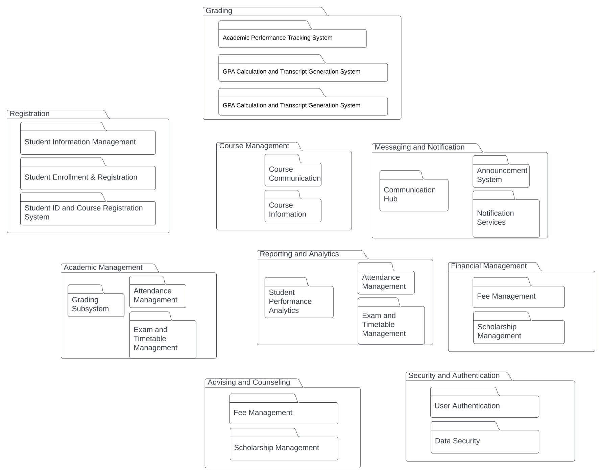

# Student Information System Documentation 

- ### Structure Diagrams
  - #### Component Diagram
    - Include a brief explanation of the component diagram, highlighting the major components of your system and how they interact.
      - 
  - #### Package Diagram
    - Explain the package diagram and how it represents the organization and dependencies of packages in your project.
      - 
  - #### Class Diagram
    - Provide an overview of the class diagram, showcasing the classes, their attributes, and relationships within your system.
      - 
- ### Behavior Diagrams
  - #### Use Case Diagram
    - Describe the use case diagram, illustrating the different use cases and actors in your system.
      - 
  - #### Sequence Diagram
    - Detail the sequence diagram, showing the interactions between different components or objects in a sequential order.
      - 
  - #### State Diagram
    - Represents the different states that an object or system can be in and the transitions between these states in response to events.
      - 
  - #### Activity Diagram
    - illustrates the flow of activities in a system, representing the workflow or business processes.
      - 
- ### Entity Relationship Diagram (ERD)
  - Visual representation of the relationships among entities in a database. It shows how different entities are related to each other.
    - 

e